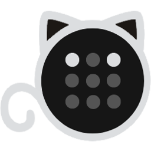

<div align="center">
<a href="https://github.com/nerdyslacker/cattail"></a>
</div>
<h1 align="center">Cattail</h1>

<div align="center">

[](https://github.com/nerdyslacker/cattail/blob/main/LICENSE)
[](https://github.com/nerdyslacker/cattail/releases)

[](https://github.com/nerdyslacker/cattail/stargazers)
[](https://github.com/nerdyslacker/cattail/fork)

<strong>Cattail is tailscale/headscale client for Linux and Windows developed using [Wails](https://wails.io) project and [Naive UI](https://www.naiveui.com) library.</strong>

</div>

> :warning: This application is an independent project and is not affiliated with the official Tailscale project. Use it at your own risk. The developers are not responsible for any issues or damages that may arise from using this application.

<picture>
    
</picture>

# Features

- [x] Account switching
- [x] Detailed peer information
- [x] Tray menu for quick access
- [x] Copying of IP addresses/DNS name
- [ ] Pinging of peers
- [ ] Set control URL
- [ ] Adding tags
- [x] Exit node management
- [x] Allow LAN access
- [x] Accept routes
- [x] Run SSH
- [ ] Advertise routes
- [x] Toggle tailscale status
- [ ] Toggle taildrop status and change path
- [x] Sending files
- [x] Receiving files
- [ ] Notification on tailscale status change
- [ ] Notification on peer addition/removal
- [ ] Monitoring traffic

# Installation

```bash
go install github.com/wailsapp/wails/v2/cmd/wails@latest
git clone https://github.com/nerdyslacker/cattail
cd cattail
make install
```

or download the binary from [Releases](https://github.com/nerdyslacker/cattail/releases) page.


# Credits 

* [dgrr/tailscale-client](https://github.com/dgrr/tailscale-client)
* [DeedleFake/trayscale](https://github.com/DeedleFake/trayscale)
* [tiny-craft/tiny-rdm](https://github.com/tiny-craft/tiny-rdm)
* [KSurzyn](https://github.com/KSurzyn) (for logo)
