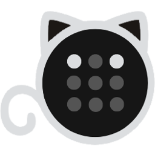
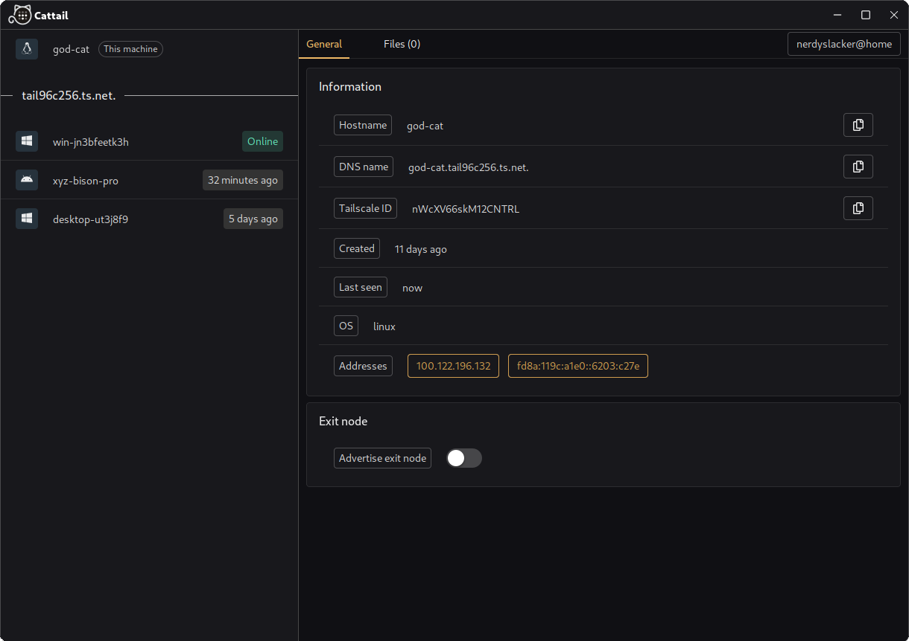

# Cattail

Cattail is an unofficial tailscale/headscale client using [Wails](https://wails.io) (Go + Vue3).

<div style="text-align: center;">
    
</div>

# Installation

```bash
go install github.com/wailsapp/wails/v2/cmd/wails@latest
git clone https://github.com/nerdyslacker/cattail
cd cattail
make install
```

# Features

* File upload and reception.
* Account switching.
* Host listing.
* Select an exit node.
* Host IP listing.
* Some tag description (like OS, or whether it's online or how long since it was last seen).

<div style="text-align: center;">
    
</div>

# Credits 

* [dgrr/tailscale-client](https://github.com/dgrr/tailscale-client)
* [DeedleFake/trayscale](https://github.com/DeedleFake/trayscale)
* [tiny-craft/tiny-rdm](https://github.com/tiny-craft/tiny-rdm)
* [KSurzyn](https://github.com/KSurzyn) (for logo)